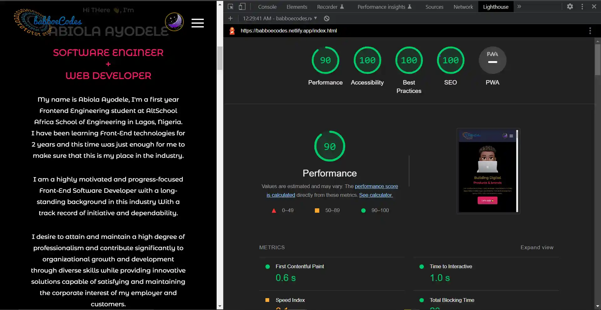

# babboeCodes----My-Portfolio-Website

A multi page Portfolio website for babboeCodes, built with HTML, CSS and JavaScript(Vanilla), It was built with a lot of animations and features that makes it very Interactive such as toggle-dark-mode and lots more,
It definitely serves its purpose for what is intended for.
Design inspirations were gotten from a some community designs on figma, Links are below
- [Creative Portfolio](https://www.figma.com/file/64sRFZtjWCQv7ANUlyWvIK/Creative-Portfolio---Web-(Community)?node-id=0%3A1)
- [Portfolio-Tomasz Gajda](https://www.figma.com/file/82tIHKcDBFbl09z8BKt7w6/Portfolio---Tomasz-Gajda-(Community)?node-id=0%3A1)

## Table of contents

- [Overview](#overview)
  - [The challenge](#the-challenge)
  - [Screenshots](#screenshot)
  - [Links](#links)
  - [Performance Test Result](#performance-testscore)
- [My process](#my-process)
  - [Built with](#built-with)
- [Author](#author)

## Overview

### The challenge

Users should be able to:

- View the optimal layout for the site depending on their device's screen size
- See hover states for all interactive elements on the page
- browse and move through the pages from any of the webpages
- Click and download CV/resume on the "Download CV" button
- Click the "More works" to got to works page
- Click the "View on Github" to got to Github repositories
- Flip project tile and click to view Live link 
- fill and submit form on Contact page
- Locate author on the map (using development mode maps api)
- fill email input and send
- Contact author through social media links

### Screenshot

Below is a preview of the babboeCodes portfolio website on desktop view  

### Links

- Live Site URL: [babboeCodes](https://your-live-site-url.com)

### Performance TestScore

Below is a lighthouse performance test score of the website Homepage  

## My process

### Built with

- Semantic HTML5 markup
- CSS custom properties
- Flexbox & Grid
- CSS animations
- JavaScript (vanilla)
- Figma
- Mobile-first workflow
- Google maps API

## Author

- LinkedIn - [Ayodele Abiola](https://www.linkedin.com/in/abiola-ayodele-5a10651b7/)
- Twitter - [@ausstinab](https://www.twitter.com/ausstinab)